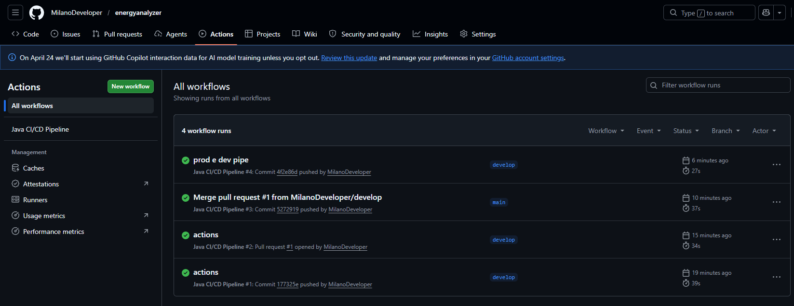

Projeto - Energy Analyzer
Como executar localmente com Docker
A aplicação foi estruturada para rodar de forma isolada em containers, garantindo que todas as dependências (como o driver Oracle) estejam presentes.

Configuração de variáveis: Certifique-se de que o arquivo dev.env está na raiz do projeto. Ele contém as credenciais de acesso ao Oracle da FIAP.

Build e Execução: No terminal, execute o comando:

Bash
docker-compose up --build
Ambiente: O Docker Compose carregará as definições do dev.env e mapeará a porta 8080 (ou a definida no seu .env) para o seu host local.

Pipeline CI/CD
Foi implementada uma esteira de automação robusta utilizando GitHub Actions, acionada ao realizar o push do código no projeto.

Etapas do Pipeline:

Build & Test: O Maven realiza a compilação utilizando o JDK 21 e executa os testes unitários/integração.

Staging: Simulação de deploy em ambiente de homologação para validação de QA.

Production: Etapa final de deploy, disparada sequencialmente após a validação em staging, garantindo que apenas código estável chegue ao destino final.

Containerização
Utilizamos a técnica de Multi-stage Build no Dockerfile para otimizar o tamanho da imagem final e aumentar a segurança, separando o ambiente de compilação do ambiente de runtime.

Conteúdo do Dockerfile:

Dockerfile
# Stage 1: Build (Maven + JDK 21)
FROM eclipse-temurin:21-jdk-jammy AS build
WORKDIR /app
COPY . .
RUN ./mvnw clean package -DskipTests

# Stage 2: Runtime (JRE 21)
FROM eclipse-temurin:21-jre-jammy
WORKDIR /app
COPY --from=build /app/target/*.jar app.jar
EXPOSE 8080
ENTRYPOINT ["java", "-jar", "app.jar"]
Prints do funcionamento
Pipeline de CI/CD: 

Abaixo, link do job com sucesso no github actions
https://github.com/MilanoDeveloper/energyanalyzer/actions/runs/24741767550

Tecnologias utilizadas:

-Java 21: Versão LTS
-Spring Boot 3.5.7
-Oracle Database
-Flyway
-Docker & Docker Composeo.
-GitHub Actions